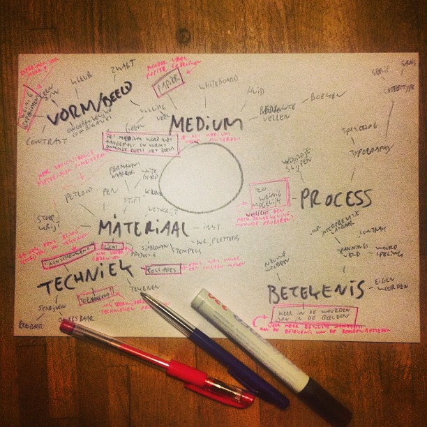

# Random Inspiration Picker

Randomly select drawing challenges to add constraints and variety to drawing sessions.

## Background

On July 16, 2013, after a discussion about adding more challenge to my drawing sessions, I brainstormed ways to interact with my drawing media and wrote down the things I did least.

[][1]

For each, I made a small card. Every time I sat down to draw, I would randomly grab three cards and try to adhere to those challenges while drawing.

There were two main drawbacks: I couldn’t use the cards if I didn’t have them with me, and they were getting worn out.

So, I created a digital version—the Random Inspiration Picker.

[][1]

## Install

No installation is required.

## Usage

Open [the Random Inspiration Picker website][1] in a web browser.
Refresh the page to get different results.

## Contributions

Contributions are not expected nor accepted.

## License

This project is created by [Potherca](https://pother.ca) under a [GNU General Public License v3.0 or later (GPL-3.0-or-later)](https://spdx.org/licenses/GPL-3.0-or-later.html).  

[1]: https://blog.pother.ca/random-inspiration-picker/
